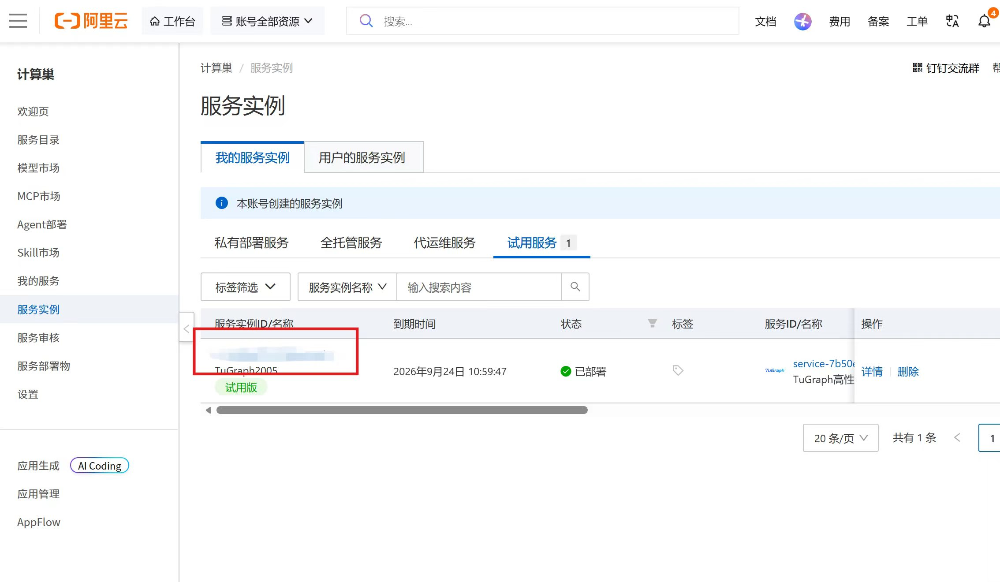
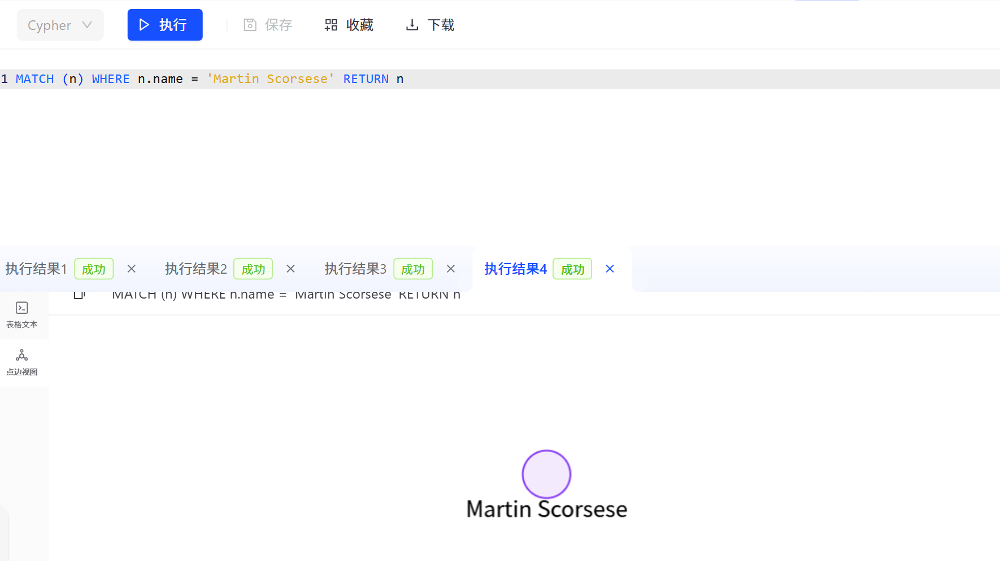

# 01 图数据库TuGraph

- [一、TuGraph平台部署及登录步骤](#一tugraph平台部署及登录步骤)
    - [1. 打开阿里云-计算，为了无法计算的价值，注册登录](#1-打开阿里云-计算为了无法计算的价值注册登录)
    - [2. 点击右上角“控制台”，完成实名认证](#2-点击右上角控制台完成实名认证)
    - [3. 接着打开TuGraph服务实例部署文档，点击部署链接](#3-接着打开tugraph服务实例部署文档点击部署链接)
    - [4. 跳转后点击页面“试用申请”按钮后等待审核，刷新页面后按钮消失即为审核通过，填写实例信息，点击“确认订单”](#4-跳转后点击页面试用申请按钮后等待审核刷新页面后按钮消失即为审核通过填写实例信息点击确认订单)
    - [5. 勾选协议之后点击“开始免费使用”，创建实例成功](#5-勾选协议之后点击开始免费使用创建实例成功)
    - [6. 点击ID（蓝色）进入到对应的服务实例后，可以在页面上获取到web、rpc、ssh、bolt共4种使用方式，并且页面上展示了admin用户的密码，其中bolt字段和密码在登陆时需要用到。](#6-点击id蓝色进入到对应的服务实例后可以在页面上获取到webrpcsshbolt共4种使用方式并且页面上展示了admin用户的密码其中bolt字段和密码在登陆时需要用到)
    - [7. 点击browser打开web登录界面，填入之前获取的bolt和密码，账号为默认的“admin”，点击“登录”](#7-点击browser打开web登录界面填入之前获取的bolt和密码账号为默认的admin点击登录)
    - [8. 图数据库登录成功](#8-图数据库登录成功)
- [二、模型建立、数据导入、增删改查](#二模型建立数据导入增删改查)
    - [1. 数据集准备](#1-数据集准备)
    - [2. 具体步骤](#2-具体步骤)
        - [2.1 模型建立](#21-模型建立)
        - [2.2 数据导入](#22-数据导入)
        - [2.3 “增删改查”](#23-增删改查)
            - [2.3.1 查](#231-查)
                - [（1）查询所有节点](#1查询所有节点)
                - [（2）根据标签匹配节点](#2根据标签匹配节点)
                - [（3）根据标签和属性匹配节点](#3根据标签和属性匹配节点)
                - [（4）匹配任意关系](#4匹配任意关系)
                - [（5）过滤匹配](#5过滤匹配)
            - [2.3.2 增](#232-增)
                - [（1）创建节点（create）](#1创建节点create)
                - [（2）创建关系（create）](#2创建关系create)
            - [2.3.3 改](#233-改)
                - [（1）更新数据（set)](#1更新数据set)
            - [2.3.4 删](#234-删)
                - [（1）删除（delete、remove)](#1删除deleteremove)
        - [2.4 复杂查询](#24-复杂查询)
            - [2.4.1 路径匹配](#241-路径匹配)
            - [2.4.2 聚合与排序](#242-聚合与排序)
                - [（1）计算节点总数（count）](#1计算节点总数count)
                - [（2）排序（order by）](#2排序order-by)
- [三、设计一个聚合查询的例子](#三设计一个聚合查询的例子)
    - [题目：统计每年的出品电影数量，并按从多到少排序](#题目统计每年的出品电影数量并按从多到少排序)

# 一、TuGraph平台部署及登录步骤

### 1\. 打开[阿里云\-计算，为了无法计算的价值](https://www.aliyun.com/?spm=5176.30275541.J_4VYgf18xNlTAyFFbOuOQe.d_logo.33522f3dAPXx03)，注册登录

### 2\. 点击右上角“控制台”，完成实名认证


## 

### 3\. 接着打开[TuGraph服务实例部署文档](https://help.aliyun.com/zh/compute-nest/use-cases/tugraph-service-instance-deployment-documentation?spm=5176.30275541.J_ZGek9Blx07Hclc3Ddt9dg.1.33522f3dAPXx03&scm=20140722.S_help@@%E6%96%87%E6%A1%A3@@2636312._.ID_help@@%E6%96%87%E6%A1%A3@@2636312-RL_tugraph-LOC_2024SPAllResult-OR_ser-PAR1_0abb7ede17896135243011229e3c2c-V_4-PAR3_o-RE_new13-P0_0-P1_0)，点击部署链接


## 

### 4\. 跳转后点击页面“试用申请”按钮后等待审核，刷新页面后按钮消失即为审核通过，填写实例信息，点击“确认订单”


## 

### 5\. 勾选协议之后点击“开始免费使用”，创建实例成功


### 6\. 点击ID（蓝色）进入到对应的服务实例后，可以在页面上获取到web、rpc、ssh、bolt共4种使用方式，并且页面上展示了admin用户的密码，其中bolt字段和密码在登陆时需要用到。




## 

### 7\. 点击browser打开web登录界面，填入之前获取的bolt和密码，账号为默认的“admin”，点击“登录”


## 

### 8\. 图数据库登录成功


# 二、模型建立、数据导入、增删改查

以电影数据为例，进行模型建立及数据导入示例

## 1\. 数据集准备

[movie\.csv](图片和附件/movie.csv)

[person\.csv](图片和附件/person.csv)

[produce\.csv](图片和附件/produce.csv)

## 2\. 具体步骤

### 2\.1 模型建立

**添加点**

新建图项目 ——》图构建 ——》添加点（点类型名称：person\) ——》添加属性（id、name、born、poster\_image）并选择数据类型 ——》完成 ——》添加点（点类型名称：movie\) ——》添加属性\(id、title、tagline等）并选择数据类型 ——》完成

**添加边**

添加边（边类型名称：produce\) ——》添加起点（person）和终点（movie\) ——》完成


### 2\.2 数据导入

点击“数据导入” ——》点击数据对应表区域，选择person\.csv打开 ——》"标签"选择点、person ——》选择对应列的属性名 ——》同理，完成点movie数据的导入 ——》类似地，从produce\.csv导入边


### 2\.3 “增删改查”

#### 2\.3\.1 查

#### （1）查询所有节点

```Plain Text
MATCH (n) RETURN n
```


**    **

**使用limit可以限制查询节点个数**


#### （2）根据标签匹配节点

例如：匹配所有的person

```Plain Text
match (n:person) return n #查找并返回数据库中所有标签为 "person" 的节点
```


#### （3）根据标签和属性匹配节点

例如：匹配name为Martin Scorsese的person节点

```Plain Text
MATCH (n) WHERE n.name = 'Martin Scorsese' RETURN n
或者
match （n:person {name:'Martin Scorsese'}）return n
```





#### （4）匹配任意关系

```Plain Text
match p = (n)-[r]->(m) return p #查找并返回数据库中所有的“关系路径”（即：节点 -> 关系 -> 节点）
```


#### （5）过滤匹配

```Plain Text
match p = (n)-[r]->(m:movie{title:'The Lord of the Rings: The Return of the King'}) return p  
#查找并返回所有指向电影《指环王：王者无敌》的完整关系路径
```


```Plain Text
MATCH (n:person)-[r:produce]->(m:movie) where n.name='Peter Jackson' return m.title  
#查找名为 "Peter Jackson"（彼得·杰克逊）的人所制作/出品的所有电影，并仅返回这些电影的标题
```


```Plain Text
MATCH (n:movie) where n.title starts with "The Lord of the Rings" return n.title
#查找所有标题以 "The Lord of the Rings"（指环王）开头的电影，并仅返回这些电影的标题
```


#### 

#### 2\.3\.2 增

#### （1）创建节点（create）

创建一个James Wan 的 person节点

```Plain Text
create (n:person{name:'James Wan',id:10000,born:1977})
MATCH (n:person {name:'James Wan'}) return n
```


然后再创建一个Fast \& Furious 7的movie节点

```Plain Text
create (n:movie {title:'Fast & Furious 7',id:10001})
```


#### （2）创建关系（create）

例如：创建一个James Wan制作Fast \& Furious 7的关系，逻辑是先匹配后连接

```Plain Text
MATCH (n:person),(m:movie)WHERE n.name = 'James Wan' AND m.title = 'Fast & Furious 7' 
CREATE (n) -[r:produce]-> (m) RETURN r 
```


#### 

#### 2\.3\.3 改

#### （1）更新数据（set\)

例如：给James Wan添加一张照片

```Plain Text
MATCH (n:person{name:'James Wan'}) set n.poster_image ='this is an image' RETURN n
```


#### 

#### 2\.3\.4 删

#### （1）删除（DELETE、REMOVE\)

两种删除方法，DELETE和REMOVE。DELETE用于删除节点和关系，REMOVE用于删除节点和关系的标签与属性。两者都需要配合MATCH，先匹配到内容，再执行操作。例如：把James Wan的照片删除

```Plain Text
MATCH (n:person{name:'James Wan'}) REMOVE n.poster_image RETURN n
```


要删除James Wan，需要同时删除该节点以及与之相关的所有的边

```Plain Text
MATCH (n:person{name:'James Wan'}) -[r]- () DELETE n,r
```


### 2\.4 复杂查询

#### 2\.4\.1 路径匹配

```Plain Text
MATCH p=(n)-[*..2]-(m) WHERE n.born > 1970 RETURN p
#查找所有年份大于1970的节点，并返回与这些节点距离在 2 跳（2 hops）以内的所有关系路径
```


#### 2\.4\.2 聚合与排序

#### （1）计算节点总数（count）

```Plain Text
MATCH (n) RETURN count(n) AS total
#统计图数据库中所有节点的总数量，并将这个统计结果命名为  total  返回
```


#### （2）排序（order by）

逻辑是在返回的数据中排序，降序DESC、 升序ASC（默认，可省略）

```Plain Text
MATCH (n) RETURN n ORDER BY n.age DESC LIMIT 10
#查找图数据库中的所有节点，按照  age （年龄）属性从大到小（降序）进行排序，并且只返回排名前 10 的节点
```


# 三、设计一个聚合查询的例子

### 题目：统计每年的出品电影数量，并按从多到少排序

```Plain Text
match (n:person) return n.born,count(n) as number order by number desc 
```


